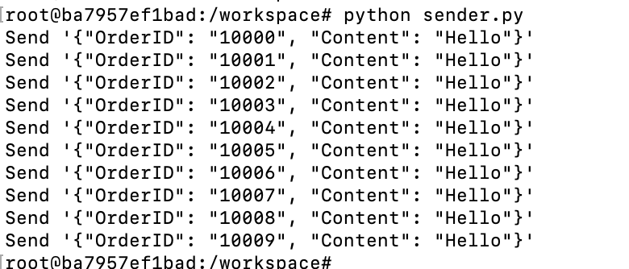
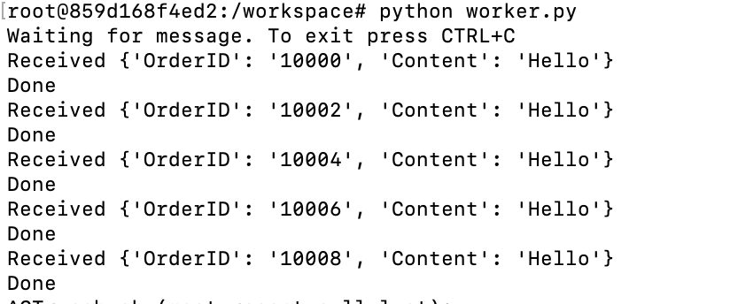
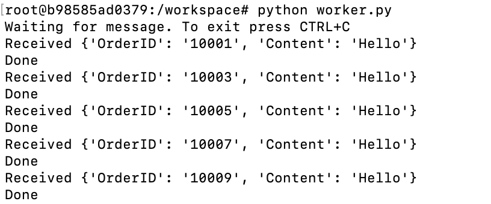

# RabbitMQ 循环分发

## 环境构建

### RabbitMQ环境（rabbitMQ server端）

- 构建

```bash
$ docker pull rabbitmq:management
```

- 启动RabbitMQ

```bash
$ docker run -d --name rabbit -e RABBITMQ_DEFAULT_USER=admin -e RABBITMQ_DEFAULT_PASS=admin -p 15672:15672 -p 5672:5672 rabbitmq:management
```

**备注** : 15672是管理界面的端口，5672是服务的端口。这里顺便将管理系统的用户名和密码设置为admin admin 默认账号和密码是guest guest。

- Web管理界面

1. 打开浏览器输入 http://<本机IP>:15672；

2. 账号密码均输入 admin（启动时所设置的）

### python环境（rabbitMQ client端）

由于笔者本机 python 没有 ssl 认证，连接rabbitMQ会报错，所以使用的 docker 镜像中的 python 环境（这样就跳过了ssl认证，笔者真是个天才）

- 构建

找到一个包含python的docker环境，笔者的为 `general-python3.6:with-vim-v1`

```bash
$ docker run -it -v $PWD:/workspace general-python3.6:with-vim-v1 bash
# pip install pika -i https://pypi.tuna.tsinghua.edu.cn/simple
```

后续代码放到 $PWD(自己指定的路径) 下，并使用 docker 中的 python 环境执行。

## python客户端

### 生产者

- Sender.py

```python
# -*- coding:utf-8 -*-

"""
    RabbitMQ 生产者
"""

import pika
import json

credentials = pika.PlainCredentials(username='admin', password='admin')
connection = pika.BlockingConnection(
    pika.ConnectionParameters(host='169.254.207.36', port=5672, virtual_host='/', credentials=credentials))
channel = connection.channel()

channel.queue_declare(queue='task_queue', durable=True)  # durable为True，消息队列持久化

for i in range(10):
    message = json.dumps({"OrderID": "1000%s" % i, "Content": "Hello"})
    channel.basic_publish(
        exchange='',
        routing_key='task_queue',
        body=message,
        properties=pika.BasicProperties(delivery_mode=2)  # 消息持久化
    )
    print("Send %r" % message)

connection.close()

```

### 消费者

- Worker.py

其中 `time.sleep(round(random.uniform(1, 8), 2))`模拟数据处理过程，并模拟worker处理能力的差距

```python
# -*- coding:utf-8 -*-

"""
    RabbitMQ 消费者
"""

import time
import json
import pika
import random

credentials = pika.PlainCredentials(username="admin", password="admin")
connection = pika.BlockingConnection(
    pika.ConnectionParameters(host='169.254.207.36', port=5672, virtual_host='/', credentials=credentials))
channel = connection.channel()

channel.queue_declare(queue="task_queue", durable=True)  # durable为True，消息队列持久化
print("Waiting for message. To exit press CTRL+C")


def callback(ch, method, properties, body):
    print("Received %s" % json.loads(body.decode()))
    # 模拟数据处理过程
    # time.sleep(round(random.uniform(2, 3), 2))  # worker实力相当
    time.sleep(round(random.uniform(1, 8), 2))  # worker实力差别大
    print("Done")
    # 手动对消息进行确认
    ch.basic_ack(delivery_tag=method.delivery_tag)

    
channel.basic_consume("task_queue", callback)
channel.start_consuming()

```

### 启动及查看效果

启动 3 个 docker 容器，1 个为生产者，2 个为消费者。

- 一个生产者 sender

```bash
$ docker run -it -v $PWD:/workspace general-python3.6:with-vim-v1 bash
# cd /workspace
# python sender.py
```

结果如下图：



***说明：***共 10 条消息，按照 OrderID 从 10000 到 10009 顺序发布到消息队列。

- 第一个消费者 worker0

```bash
$ docker run -it -v $PWD:/workspace general-python3.6:with-vim-v1 bash
# cd /workspace
# python worker.py
```

结果如下图：



- 第二个消费者 worker1

```bash
$ docker run -it -v $PWD:/workspace general-python3.6:with-vim-v1 bash
# cd /workspace
# python worker.py
```

结果如下图：



***说明：***处理能力差距较大情况下，依然顺序的分发每个Message，worker0 为 0，2，4，6，8；worker1 为 1，3，5，7，9。

公平分发机制中会解决这个问题。

## 参考链接

`https://www.cnblogs.com/zijiyanxi/p/7648062.html`

`https://blog.csdn.net/qq_29663071/article/details/54895077`

